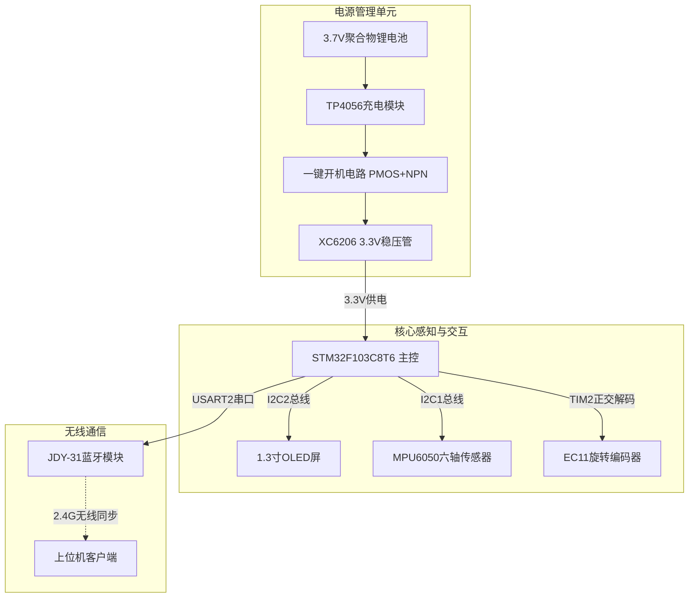
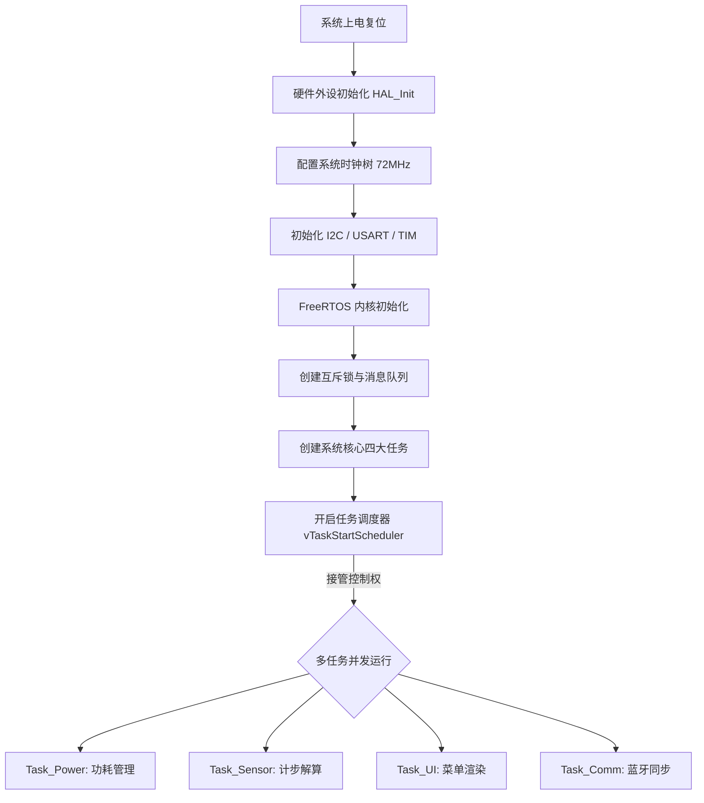

# 《系统设计文档》- 基于STM32的智能手表设计

## 一、 物料到位情况

根据前期的《物料采购计划》，本项目所需元器件已于 6 月 30 日统一从线上配单商城下单。截至 7 月 2 日汇报前，物料到位与核对情况如下：

| 物料名称 | 规格型号 | 计划数量 | 到位情况 | 预计到位/调试时间 |
| :--- | :--- | :---: | :---: | :--- |
| **主控核心板** | STM32F103C8T6 最小系统板 | 1 | **已到位** | 已完成外观与通电核对 |
| **显示模块** | 1.3寸 OLED (I2C接口) | 1 | **已到位** | 已完成实物引脚核对 |
| **传感器** | MPU6050 六轴陀螺仪 | 1 | **已到位** | 已完成实物核对 |
| **交互器件** | EC11 旋转编码器 | 1 | **已到位** | 已核对微动按键阻尼 |
| **通信模块** | JDY-31 经典蓝牙模块 | 1 | 运输中 | 预计 7月2日 下午到位 |
| **电源与辅料** | 锂电池、分立元器件、面包板等 | 1套 | **已到位** | 已完成清点，随时可搭电路 |

---

## 二、 系统方案设计

### 1. 系统总体架构
本智能手表系统采用“单主控 + 外围功能模块 + 实时操作系统”的架构模式。硬件以 STM32F103C8T6 为核心，通过硬件总线（I2C、USART、TIM）与各个外设进行高速通信；供电采用一键开机拓扑与 LDO 线性降压，保证可穿戴设备的低功耗与便携性。软件抛弃传统的裸机大循环，全面依托 FreeRTOS 抢占式内核进行并发任务调度。

### 2. 硬件框图

### 3. 软件流程图

---

## 三、 详细设计文档

本章节分为硬件与软件两大部分，明确关键技术实现细节。

### 1. 硬件部分详细设计
* **电路拓扑与外设分配：**
  * **I2C 总线分离**：为避免总线冲突并提高刷新率，OLED 屏挂载于独立的 `I2C2`（PB10/PB11），MPU6050 挂载于 `I2C1`（PB6/PB7）。
  * **正交解码接口**：EC11 的 A/B 相接入 STM32 的 `TIM2_CH1` 和 `TIM2_CH2`，利用硬件外设直接处理旋转方向与步数，避免使用外部中断造成的 CPU 资源浪费和消抖难题。
  * **一键开机电路（对齐大纲要求）：** 采用 SI2301 (PMOS) 搭配 S8050 (NPN) 设计。按键按下时，NPN 导通拉低 PMOS 栅极实现上电，主控运行后立即拉高特定 GPIO 维持 NPN 导通，实现软自锁开机；长按按键触发外部中断，主控拉低 GPIO 实现软关机。
* **PCB布局规划说明：**
  * 根据前期《项目计划书》的战略规划，本项目放弃扩展要求3（PCB打样），采用高品质面包板与排线进行模块化互联。电源部分将严格做好滤波（在3.3V入口并联 10uF 陶瓷电容），防止高频数字信号串扰。

### 2. 软件部分详细设计
* **模块划分：**
  * **驱动层 (Driver)**：基于 HAL 库的 I2C、USART、TIM 硬件收发模块。
  * **系统层 (OS)**：FreeRTOS 内核、`heap_4` 内存管理、SysTick 软件秒时钟驱动。
  * **应用层 (App)**：计步滤波算法模块、UI 状态机模块、蓝牙通信封包模块。
* **关键算法描述（动态计步滤波算法）：**
  * 提取 MPU6050 三轴加速度 $(A_x, A_y, A_z)$，计算合加速度 $A = \sqrt{A_x^2 + A_y^2 + A_z^2}$。
  * 将数据推入长度为 N 的滑动窗口进行算术平均，滤除高频电噪声。
  * 采用**动态阈值法**，实时计算过去 50 个采样点的最大值与最小值，以其均值作为判定步态波峰的动态基准线。当当前加速度穿越该基准线且距离上次计步时间差 `> 200ms`（防止单步抖动多计），则有效步数 `+1`。
* **任务调度设计（FreeRTOS任务划分）：**

| 任务名称 | 优先级 | 职责深度解析 |
| :--- | :---: | :--- |
| **Task_Power** | `osPriorityHigh` (4) | 轮询系统空闲标志。若 >10s 无任何按键或编码器操作，切断 OLED 电源并调用 `HAL_PWR_EnterSTOPMode()`。 |
| **Task_Sensor**| `osPriorityAboveNormal` (3)| 每 20ms 周期唤醒，读取 I2C1，执行上述计步滤波算法，并将结果通过队列发送至 UI 任务。 |
| **Task_UI** | `osPriorityNormal` (2) | 等待编码器事件队列。采用结构体数组（包含当前状态、下一状态、执行函数指针）构建多级菜单。获取互斥锁后刷新 I2C2。 |
| **Task_Comm** | `osPriorityBelowNormal` (1)| 等待 USART2 接收中断的信号量，解析上位机指令后，打包 RAM 中的步数与时钟数据回传。 |

---

## 四、 进度汇报与后续计划

### 1. 当前完成情况
截至 7 月 2 日汇报时，本小组已按期完成以下工作：
* **理论规划**：核心硬件 BOM 采购完成，引脚资源全部分配完毕。
* **开发环境**：已完成 STM32CubeMX 工程的初始配置（时钟树 72MHz、外设引脚、FreeRTOS 中间件勾选）。
* **硬件预研**：一键开机电路已在面包板上搭建并使用万用表验证自锁逻辑成功；OLED 屏幕在裸机环境下点亮测试通过。

### 2. 后续工作计划
为了顺利迎接 7 月 6 日的中期检查，接下来的 3 天内，本组计划：
* **7月3日**：完成 FreeRTOS 任务代码框架的构建，解决 EC11 编码器正交解码的数值漂移问题。
* **7月4日**：全力攻坚 MPU6050 的读取与动态计步滤波算法的编写，确保步数识别精准。
* **7月5日**：编写多级结构体菜单状态机，将计步数据与软件时钟数据映射到 OLED 屏幕上。完成系统初步联调，录制演示视频备战中期检查。
