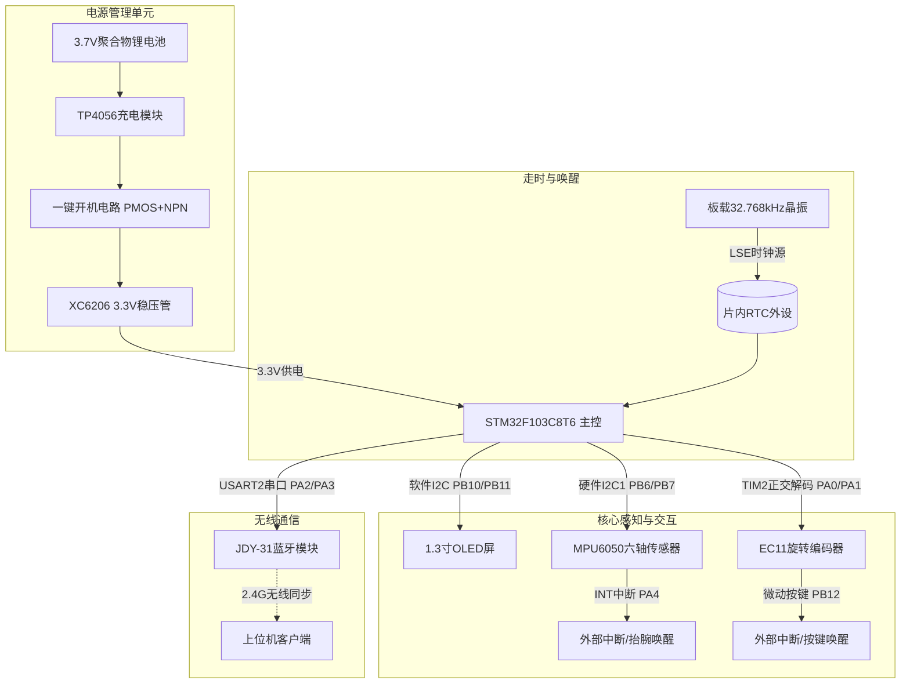
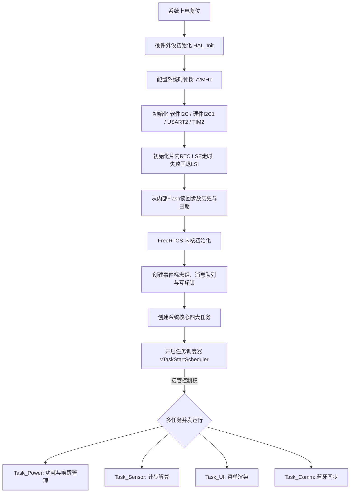

# 《系统设计文档》- 基于STM32的智能手表设计

## 一、 物料到位情况

根据前期的《物料采购计划》，本项目所需元器件已于 6 月 30 日统一从线上配单商城下单。截至 7 月 2 日汇报前，物料到位与核对情况如下：

| 物料名称 | 规格型号 | 计划数量 | 到位情况 | 预计到位/调试时间 |
| :--- | :--- | :---: | :---: | :--- |
| **主控核心板** | STM32F103C8T6 最小系统板 | 1 | **已到位** | 已完成外观与通电核对 |
| **显示模块** | 1.3寸 OLED (I2C接口) | 1 | **已到位** | 已完成实物引脚核对 |
| **传感器** | MPU6050 六轴陀螺仪 | 1 | **已到位** | 已完成实物核对 |
| **交互器件** | EC11 旋转编码器 | 1 | **已到位** | 已核对微动按键阻尼 |
| **通信模块** | JDY-31 经典蓝牙模块 | 1 | 运输中 | 预计 7月2日 下午到位 |
| **电源与辅料** | 锂电池、分立元器件、面包板等 | 1套 | **已到位** | 已完成清点，随时可搭电路 |

> **说明：** 本设计的实时时钟采用 STM32F103 **片内 RTC 外设**，并复用最小系统板上**板载的 32.768kHz 晶振**作为低速外部时钟（LSE），不引入任何额外的 RTC 芯片，因此 BOM 与预算不变。

---

## 二、 系统方案设计

### 1. 系统总体架构
本智能手表系统采用“单主控 + 外围功能模块 + 实时操作系统”的架构模式。硬件以 STM32F103C8T6 为核心，通过硬件总线（I2C、USART、TIM）与各个外设进行通信；走时基准由片内 RTC 外设独立维护，保证在低功耗休眠期间时间仍持续累计；供电采用一键开机拓扑与 LDO 线性降压，保证可穿戴设备的低功耗与便携性。软件抛弃传统的裸机大循环，全面依托 FreeRTOS 抢占式内核进行并发任务调度。

为提高总线可靠性，OLED 显示屏采用 **软件模拟 I2C（GPIO 位翻转）** 驱动，MPU6050 采用 **硬件 I2C1** 驱动。这样两路 I2C 在物理上彻底分离、互不干扰，既规避了 STM32F1 系列硬件 I2C 外设已知的总线死锁问题（仅对时序不敏感的 OLED 使用软件 I2C，对采样实时性较高的 MPU6050 保留硬件 I2C），又从根本上消除了总线访问冲突。

### 2. 硬件框图

### 3. 软件流程图

---

## 三、 详细设计文档

本章节分为硬件与软件两大部分，明确关键技术实现细节。

### 1. 硬件部分详细设计
* **总线分配与可靠性设计：**
  * **OLED — 软件模拟 I2C（PB10=SCL / PB11=SDA）**：OLED 刷新对时序不敏感，采用 GPIO 位翻转的软件 I2C 驱动。这样可彻底规避 STM32F1 硬件 I2C 外设众所周知的总线死锁（BUSY 卡死）缺陷，提高长时间运行稳定性。
  * **MPU6050 — 硬件 I2C1（PB6/PB7）**：传感器采样需要较高的实时吞吐，保留硬件 I2C，由 Task_Sensor 独占访问。
  * **总线冲突说明（口径修正）**：由于 OLED 走软件 I2C（独立 GPIO）、MPU6050 走硬件 I2C1，两条总线物理隔离，且每条总线仅被单一任务访问，**不存在共享总线竞争，故无需为 I2C 增设互斥锁**。任务间的数据共享改由消息队列（值拷贝）完成；仅对跨任务读写的全局结构体（如累计步数、时间快照）使用互斥锁保护，避免读写撕裂。
* **实时走时设计（RTC，关键修正点）：**
  * 走时基准由 **STM32F103 片内 RTC 外设** 维护，时钟源优先选用最小系统板**板载的 32.768kHz 晶振（LSE）**；若批次板卡未焊接 LSE，则自动回退到内部 **LSI（约 40kHz）** 作为兜底（精度略低，可标定校正）。
  * **关键优势：** RTC 位于独立的后备电源域，**在熄屏（仅关 OLED）期间仍持续走时**，从根本上解决了“软件 SysTick 计时”在进入深度休眠后时钟停摆、时间丢失的矛盾。手表休眠唤醒后时间依旧准确。
  * 时间读取通过 RTC 计数器换算为时/分/秒，UI 任务直接渲染，无需占用 CPU 做秒级软件累加。
* **熄屏与唤醒源设计：**
  * 10s 无操作后由 Task_Power 调用 `OLED_DisplayOff()` 关闭 OLED 显示，MCU 保持全速运行（不进入 STOP 模式，避免 I2C 总线竞争）；RTC 持续走时。
  * **唤醒源仅能为 EXTI 外部中断**（MCU 全速运行，所有外设始终在线“旋转”无法唤醒）：
    * **编码器微动按键（PB12 → EXTI）**：按键唤醒，恢复显示。
    * **MPU6050 运动/抬腕中断（INT → PA4 → EXTI）**：配置 MPU6050 的运动检测中断，实现“抬腕亮屏”唤醒（扩展亮点，时间紧张时可降级为仅按键唤醒）。
* **一键开机电路（对齐大纲要求）：** 采用 SI2301 (PMOS) 搭配 S8050 (NPN) 设计。按键按下时，NPN 导通拉低 PMOS 栅极实现上电，主控运行后立即拉高维持 GPIO（PA8）保持 NPN 导通，实现软自锁开机；长按按键触发外部中断，主控先将步数历史写入 Flash，再拉低维持 GPIO 实现软关机。
* **PCB布局规划说明：**
  * 根据前期《项目计划书》的战略规划，本项目放弃扩展要求3（PCB打样），采用高品质面包板与排线进行模块化互联。电源部分将严格做好滤波（在3.3V入口并联 10uF 陶瓷电容），并在 MPU6050、OLED 电源引脚就近放置 100nF 去耦电容，防止高频数字信号串扰。

### 2. 软件部分详细设计
* **模块划分：**
  * **驱动层 (Driver)**：软件 I2C（OLED）、硬件 I2C（MPU6050）、USART、TIM 编码器、RTC、内部 Flash 读写模块。
  * **系统层 (OS)**：FreeRTOS 内核、`heap_4` 内存管理、片内 RTC 秒时钟（LSE/LSI）。
  * **应用层 (App)**：计步滤波算法模块、UI 状态机模块、蓝牙通信封包模块、步数历史持久化模块。
* **关键算法描述（动态计步滤波算法）：**
  * 提取 MPU6050 三轴加速度 $(A_x, A_y, A_z)$，计算合加速度 $A = \sqrt{A_x^2 + A_y^2 + A_z^2}$。
  * 将数据推入长度为 N 的滑动窗口进行算术平均，滤除高频电噪声。
  * 采用**动态阈值法**，实时计算过去 50 个采样点的最大值与最小值，以其均值作为判定步态波峰的动态基准线。当当前加速度穿越该基准线且距离上次计步时间差 `> 200ms`（防止单步抖动多计），则有效步数 `+1`。
* **步数历史持久化（掉电保存，新增）：**
  * 当前累计步数与日期快照不仅缓存于 RAM，还**周期性（或在软关机/休眠前）写入 STM32F103C8T6 片内 Flash 的末页**，开机时由初始化流程回读，实现步数历史的掉电保存。
  * 为减少 Flash 擦写磨损，采用“低频写入 + 关机前落盘”的策略，而非每步即写。
* **任务调度设计（FreeRTOS任务划分）：**

| 任务名称 | 优先级 | 职责深度解析 |
| :--- | :---: | :--- |
| **Task_Power** | `osPriorityHigh` (4) | **事件/周期混合驱动，非忙等轮询**：以 500ms 周期 `vTaskDelay` 唤醒，比较“最近一次活动时间戳”（由 UI/Sensor 事件更新）；若 >10s 无操作，调用 `OLED_DisplayOff()` 仅关闭显示（MCU 全速运行）。熄屏时 EXTI（按键/抬腕）触发 `mark_activity()`，Task_Power 检测后调用 `OLED_DisplayOn()` 恢复显示。 |
| **Task_Sensor**| `osPriorityAboveNormal` (3)| 每 20ms 周期唤醒，读取硬件 I2C1，执行上述计步滤波算法，并将结果通过队列发送至 UI 任务，同时触发持久化模块的低频落盘。 |
| **Task_UI** | `osPriorityNormal` (2) | 等待编码器事件队列。采用结构体数组（包含当前状态、下一状态、执行函数指针）构建多级菜单。通过软件 I2C 刷新 OLED；读取 RTC 渲染时间页。 |
| **Task_Comm** | `osPriorityBelowNormal` (1)| 等待 USART2 接收中断的信号量，解析上位机指令后，打包 RTC 时间与 RAM 中的步数/历史数据回传。 |

> **设计说明：** Task_Power 虽为最高优先级，但采用“周期唤醒 + 事件标志”而非死循环轮询，唤醒后即让出 CPU，不会饿死其它任务，符合 RTOS 调度规范。

---

## 四、 进度汇报与后续计划

### 1. 当前完成情况
截至 7 月 2 日汇报时，本小组已按期完成以下工作：
* **理论规划**：核心硬件 BOM 采购完成，引脚资源全部分配完毕（含 RTC/LSE、软件 I2C、MPU INT/EXTI、一键开机维持 GPIO）。
* **开发环境**：已完成 STM32CubeMX 工程的初始配置（时钟树 72MHz、外设引脚、RTC 使能、FreeRTOS 中间件勾选）。
* **硬件预研**：一键开机电路已在面包板上搭建并使用万用表验证自锁逻辑成功；OLED 屏幕在裸机环境下（软件 I2C）点亮测试通过。

### 2. 后续工作计划
为了顺利迎接 7 月 6 日的中期检查，接下来的 3 天内，本组计划：
* **7月3日**：搭建 FreeRTOS 任务代码框架，打通 EC11 编码器正交解码并解决数值漂移问题；完成片内 RTC（LSE）走时初始化与读取。
* **7月4日**：全力攻坚 MPU6050 的读取（硬件 I2C1）与动态计步滤波算法的编写，确保步数识别精准；联调 MPU INT→EXTI 抬腕唤醒。
* **7月5日**：编写多级结构体菜单状态机，将计步数据与 RTC 时间映射到 OLED；接通内部 Flash 步数持久化；完成系统初步联调，录制演示视频备战中期检查。
