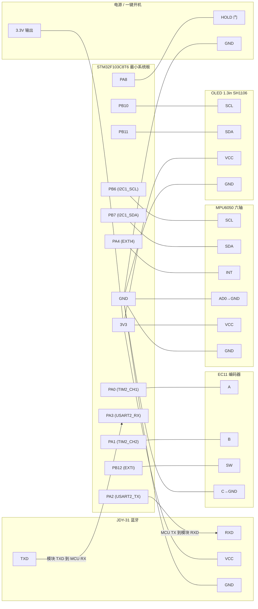
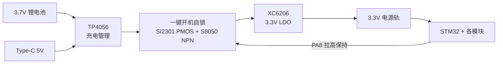

# 智能手表 · 电路接线图

> 主控：STM32F103C8T6 最小系统板
> 本文引脚与固件 [`Firmware/App/Inc/app_config.h`](../Firmware/App/Inc/app_config.h) 完全对齐，改线时请同步改该文件。
> 图形使用 **Mermaid**（纯文本，GitHub 可直接渲染）+ ASCII 示意，非位图/SVG，便于版本管理。

---

## 一、主控引脚分配表（权威）

| 外设 | 信号 | STM32 引脚 | 复用/模式 | 说明 |
|------|------|-----------|-----------|------|
| **OLED 1.3"** | SCL | **PB10** | GPIO 输出（软件 I2C） | 规避 F1 硬件 I2C 死锁 |
| （SH1106） | SDA | **PB11** | GPIO 输出（软件 I2C） | 列偏移 2 |
| **MPU6050** | SCL | **PB6** | I2C1_SCL（硬件 I2C） | 与 OLED 物理隔离 |
| （六轴） | SDA | **PB7** | I2C1_SDA（硬件 I2C） | 需 4.7k 上拉到 3.3V |
| | INT | **PA4** | EXTI4，上升沿 | 抬腕/运动中断，STOP 唤醒源 |
| **EC11 编码器** | A 相 | **PA0** | TIM2_CH1（正交解码） | 硬件解码，无需软件消抖 |
| | B 相 | **PA1** | TIM2_CH2（正交解码） | |
| | KEY 按键 | **PB12** | EXTI，下降沿，内部上拉 | 菜单确认 + STOP 唤醒源 |
| **JDY-31 蓝牙** | 模块 RXD | **PA2** | USART2_TX | 交叉连：MCU TX → 模块 RXD |
| | 模块 TXD | **PA3** | USART2_RX | 交叉连：MCU RX ← 模块 TXD |
| **一键开机** | 保持 | **PA8** | GPIO 输出，开机拉高 | 维持 NPN 导通实现软自锁 |
| **电源** | VDD | 3V3 | — | 全系统 3.3V 供电 |
| | GND | GND | — | 所有模块共地 |

> ⚠️ 全部模块按 **3.3V** 供电（JDY-31、MPU6050、OLED、SH1106 均支持 3.3V）。不要接 5V。

---

## 二、模块接线图（Mermaid）



---

## 三、ASCII 快速接线示意（面包板对照）

```
                      +---------------------------+
   OLED(SH1106)       |   STM32F103C8T6 最小系统   |        MPU6050
  +-----------+       |                           |      +-----------+
  | SCL o-----+-------o PB10                  PB6 o------o SCL        |
  | SDA o-----+-------o PB11                  PB7 o------o SDA (+4k7↑)|
  | VCC o--3V3        |                       PA4 o------o INT        |
  | GND o--GND        |                           |  +---o AD0→GND    |
  +-----------+       |                           |  |   | VCC o--3V3 |
                      |                           |  |   | GND o--GND |
   EC11 编码器         |                           |  |   +-----------+
  +-----------+       |                           |  |
  | A   o-----+-------o PA0(TIM2_CH1)             |  |    JDY-31 蓝牙
  | B   o-----+-------o PA1(TIM2_CH2)             |  |   +-----------+
  | SW  o-----+-------o PB12(EXTI)          PA2 o-+--|---o RXD  (交叉) |
  | C   o--GND        |                     PA3 o----+--o TXD  (交叉) |
  +-----------+       |                           |      | VCC o--3V3 |
                      |                       PA8 o--HOLD | GND o--GND |
                      |                      3V3  o--+    +-----------+
                      |                      GND  o--+---- 公共地 GND
                      +---------------------------+   +--- 3.3V 电源轨
                                                      |
                        电源: 3.7V锂电 → TP4056充电 → XC6206 LDO → 3.3V
                        一键开机: 轻触键 + SI2301(PMOS) + S8050(NPN) 自锁，PA8 保持
```

---

## 四、电源与一键开机链路（Mermaid）



**开机逻辑**：按下轻触键 → PMOS 导通给系统上电 → MCU 启动后立即把 **PA8** 拉高，通过 S8050 维持 PMOS 导通（软自锁）→ 松开按键系统仍保持供电。关机可由 MCU 拉低 PA8（或长按逻辑）实现。

---

## 五、接线注意事项（易错点）

1. **供电统一 3.3V**，勿接 5V；所有模块 **共地（GND）**，否则通信异常。
2. **蓝牙 TX/RX 必须交叉**：MCU 的 PA2(TX) → JDY-31 的 RXD，PA3(RX) ← JDY-31 的 TXD。接反则完全收不到数据。
3. **MPU6050 硬件 I2C（PB6/PB7）需要上拉电阻**（4.7kΩ 到 3.3V）；很多模块板载已带，若没有需外加。
4. **MPU6050 AD0 接 GND**，器件地址才是 `0x68`（固件按 0x68 配置）。
5. **OLED 用软件 I2C（PB10/PB11）**，是为规避 STM32F1 硬件 I2C 死锁缺陷，不要错接到 I2C1。
6. **屏为 SH1106**：固件 `OLED_COL_OFFSET=2`；若换成 0.96" SSD1306 屏，需在 [`bsp_oled.h`](../Firmware/App/Inc/bsp_oled.h) 改为 0。
7. **RTC 走时**：面包板若不接 VBAT 纽扣电池，彻底断电会丢时间（软复位不丢）。验收演示尽量不断总电，或给 VBAT 引脚接纽扣电池。
