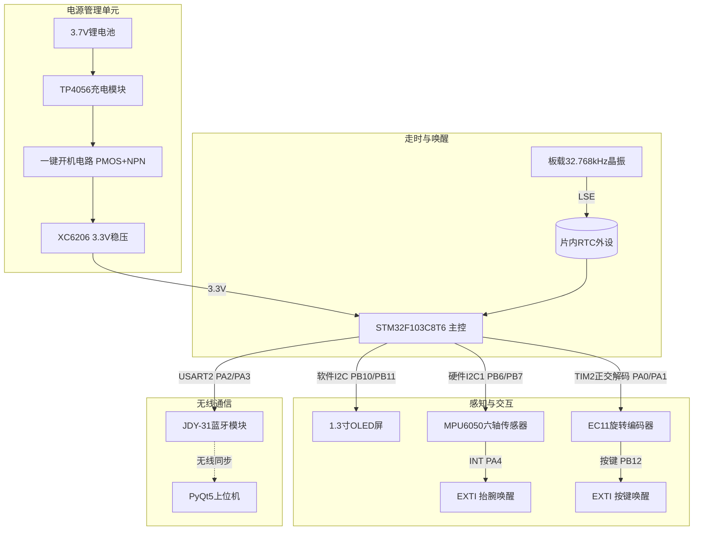
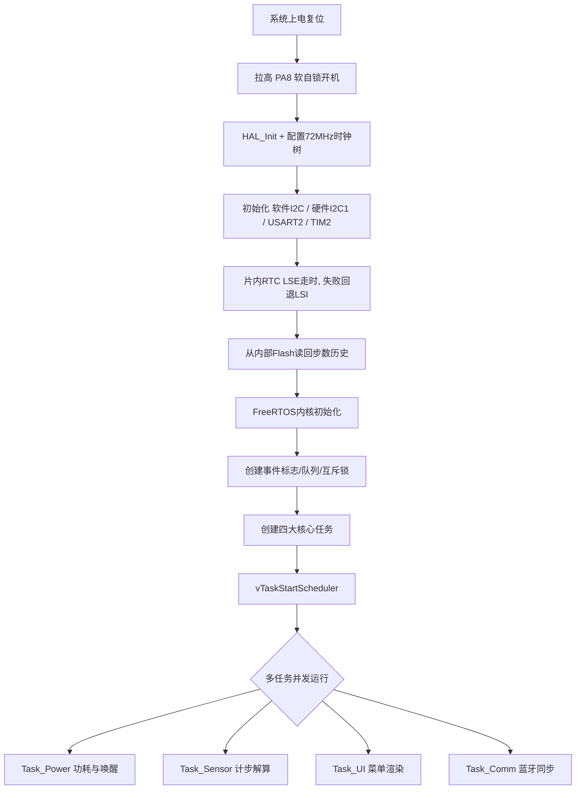

# 基于 STM32F103C8T6 的智能手表设计 — 课程设计验收报告

> 2026 嵌入式系统课程设计 · 题目 2 · 基于 FreeRTOS 实时操作系统
> 小组成员：周瑜亮（硬件与通信）、郭浩哲（内核与算法）、叶锦前（UI 与上位机）

## 一、 项目概述

本项目以 **STM32F103C8T6 最小系统板**为核心主控，采用 FreeRTOS 抢占式多任务内核调度，集成 OLED 显示、MPU6050 六轴传感器、EC11 旋转编码器、JDY-31 蓝牙模块与独立锂电池电源系统，实现智能手表的时间显示、运动计步、多级菜单人机交互、蓝牙无线数据同步等完整功能。

本项目完成课程大纲全部**基本要求**，并实现扩展要求 1（编码器多级菜单）、扩展要求 2（蓝牙上位机同步）、扩展要求 4（运动计步与数据记录），按计划不做扩展 3（PCB 设计），采用面包板模块化互联。扩展要求覆盖情况对标考核表 **“优秀”等级**的组合（基本要求 + 扩展 1/2/4）；其中计步功能已完整实现，但真机阈值标定偏灵敏、计步偏多，精度为已知不足（详见第五节）。

## 二、 验收要求完成情况（逐条对照）

### 1. 基本要求

| # | 大纲要求 | 完成情况 | 实现与证据 |
|---|----------|:---:|------|
| 1 | 完成智能手表硬件电路设计（MCU、OLED、陀螺仪、电源） | ✅ | STM32F103C8T6 主控 + 1.3″ OLED + MPU6050 六轴 + 3.7V 锂电池/TP4056/XC6206 电源 + SI2301/S8050 一键开机电路，面包板搭建并通电验证 |
| 2 | 基于 FreeRTOS 实现多任务管理，完成时间显示与传感器数据读取 | ✅ | FreeRTOS 抢占式内核，划分 Power/Sensor/UI/Comm 四任务；片内 RTC（LSE 32.768kHz）走时；MPU6050 硬件 I2C1 周期采样 |
| 3 | 实现 OLED 界面显示，至少包含时间页面与传感器数据页面 | ✅ 超出 | 软件 I2C 驱动 OLED，实现 **4 页菜单**：TIME / STEPS / SENSOR / SET TIME，并完成界面可视化重构（大字号、进度条、反白标题栏） |

### 2. 扩展要求

| # | 大纲要求 | 完成情况 | 实现要点 |
|---|----------|:---:|------|
| 1 | 增加旋转编码器，实现多级菜单的切换与选择 | ✅ | EC11 编码器 + TIM2 硬件正交解码（无阻塞）；结构体数组多级菜单状态机，支持翻页 / 数值调节 / 按键确认 |
| 2 | 增加蓝牙控制功能，实现与手机的数据同步，并设计蓝牙上位机 | ✅ | JDY-31 经典蓝牙（SPP）+ USART2 环形缓冲异步收发；PyQt5 桌面上位机实时显示时间/步数/加速度，支持校时与请求同步 |
| 4 | 实现运动计步算法与运动数据记录功能 | ✅ | 合加速度 + 滑动平均 + 动态阈值波峰检测计步算法；步数 RAM 缓存 + 片内 Flash 末页掉电持久化 |

> 扩展 3（PCB 设计）按计划不做。本项目完成全部基本要求与扩展 1、2、4，满足“优秀”等级“扩展 1、2，以及 3 或 4”的覆盖要求。

### 3. 对照“优秀”评定标准

| 优秀评定标准 | 达成情况 |
|---|---|
| 完成全部基本要求与扩展 1、2，以及 3 或 4 | ✅ 完成扩展 1 / 2 / 4 |
| 计步算法准确、数据记录完整（选 4 时） | ⚠️ 部分：算法与数据记录功能完整；真机阈值偏灵敏，静止/微动仍会计步，精度不足（已知不足，见第五节） |
| FreeRTOS 任务划分合理、无死锁 | ✅ 4 任务优先级梯度合理；消息队列 + 互斥锁保护共享数据；I2C 双总线物理隔离从根本消除总线竞争 |
| OLED 多级菜单流畅 | ✅ TIM2 硬件正交解码无阻塞；结构体状态机；界面可视化重构 |
| 蓝牙同步稳定，上位机界面美观、功能完整 | ✅ RX 看门狗 + 错误回调恢复链路；PyQt5 上位机实时同步与校时 |
| 设计文档详实，答辩表述清晰 | ✅ 计划书 / 系统设计 / 中期报告 / 故障排查记录齐全（见 `Docs/`） |

## 三、 系统设计

### 1. 系统总体架构

系统采用“单主控 + 外围功能模块 + 实时操作系统”架构。硬件以 STM32F103C8T6 为核心，通过 I2C / USART / TIM 总线连接外设；走时基准由片内 RTC 独立维护。软件全面依托 FreeRTOS 抢占式内核进行并发任务调度，跨任务共享数据由消息队列与互斥锁保护。

#### 硬件框图



#### 软件启动流程



### 2. 硬件设计要点

- **总线分配与可靠性**：OLED 采用**软件模拟 I2C**（PB10/PB11），规避 STM32F1 硬件 I2C 已知的总线死锁缺陷；MPU6050 采用**硬件 I2C1**（PB6/PB7）保证采样实时性。两路总线物理隔离，每条总线仅被单一任务访问，从根本上消除总线竞争，无需为 I2C 增设互斥锁。
- **实时走时**：复用片内 RTC 外设 + 板载 32.768kHz 晶振（LSE），LSE 缺失时自动回退片内 LSI。RTC 位于独立后备域，**熄屏期间仍持续走时**，唤醒后时间不丢失，无需软件秒级累加。
- **熄屏与唤醒**：10s 无操作仅关闭 OLED 显示（MCU 保持全速运行，规避 STOP 模式下与传感器 I2C 采样的总线竞争）；唤醒源为 EXTI 外部中断——编码器按键（PB12）与 MPU6050 运动中断（INT→PA4），实现抬腕亮屏。
- **一键开机**：SI2301（PMOS）+ S8050（NPN）软自锁拓扑，按键上电后主控拉高 PA8 维持，长按可软关机（关机前落盘步数）。

### 3. 软件设计（核心）

#### FreeRTOS 任务划分

| 任务 | 优先级 | 触发方式 | 核心职责 |
|---|:---:|---|---|
| Task_Power | 4（最高） | 500ms 周期 + 事件 | 熄屏/亮屏管理、唤醒事件处理；周期唤醒比较活动时间戳，非忙等轮询，唤醒即让出 CPU |
| Task_Sensor | 3（高） | 20ms 周期 | MPU6050 采样、计步算法运算、运动数据缓存与低频落盘 |
| Task_UI | 2（中） | 事件驱动 | 多级菜单状态机维护、OLED 界面渲染、RTC 时间读取 |
| Task_Comm | 1（低） | 数据队列触发 | 蓝牙串口异步收发、上位机指令解析、数据打包回传 |

#### 计步算法（扩展 4 核心）

1. 读取三轴加速度 $(A_x,A_y,A_z)$，计算合加速度 $A=\sqrt{A_x^2+A_y^2+A_z^2}$；
2. N 点滑动窗口算术平均，滤除高频电噪声；
3. **动态阈值法**：实时计算过去 50 个采样点的最大/最小值，以其均值为步态波峰判定基准线；
4. 当前加速度穿越基准线且距上次计步 `>200ms`（防单步抖动多计），有效步数 `+1`。

离线验证：静止 5s 计 0 步；走路 10s@2Hz 计 19 步（预期约 20 步），逻辑正确。

#### 步数历史持久化

当前累计步数与日期快照缓存于 RAM，并周期性（及关机前）写入 STM32F103C8T6 片内 Flash 末页，开机时回读，实现掉电保存。采用“低频写入 + 关机前落盘”策略，减少 Flash 擦写磨损。

#### 多级菜单状态机

采用结构体数组（含当前状态、下一状态、执行函数指针）构建多级菜单，支持多层页面嵌套跳转与参数设置。编码器旋转由 TIM2 硬件正交解码无阻塞处理，按键确认走 EXTI。

#### 蓝牙通信与上位机

- 固件侧：USART2 环形缓冲区异步收发，文本行协议 `T:hh:mm:ss S:total/today A:ax,ay,az`；支持 `SET hh mm ss` 校时指令。
- 上位机（`Host/watch_gui.py`）：PyQt5 图形界面，串口连接后实时显示手表时间、步数与加速度数据，支持校时 / 请求同步。

## 四、 关键技术问题与解决方案

真机联调阶段集中暴露了三个“仅在真机才复现”的问题，均经多轮排查定位根因并修复。完整过程见 [`Docs/故障排查记录.md`](Docs/故障排查记录.md)。

### 问题 1：蓝牙“只能收不能发”、疑似连不上手机

- **根因（主）**：旧方案无操作 10s 进入 STOP 模式，STOP 下 USART2 无时钟——手表既不推送数据也收不到命令；而 JDY-31 模块独立供电，手机仍能连上模块，于是现象恰好是“连得上却没有数据”。
- **根因（次）**：HAL 的 UART 收发共用一把锁，中断里重挂接收若撞上任务发送持锁返回 BUSY，接收从此断链；过载/帧错误（ORE/FE）后 HAL 也不自动恢复。
- **解决**：移除 STOP 改为仅关 OLED、MCU 全速运行（熄屏期间蓝牙正常工作）；新增 `HAL_UART_ErrorCallback` 清错并重挂接收；`Task_Comm` 加 RX 看门狗兜底（断链 100ms 内恢复）。
- **使用提示**：JDY-31 为经典蓝牙 SPP，iPhone 不支持、须用 Android，系统配对后需在串口 App 中主动建立 SPP 连接。

### 问题 2：开机偶发卡在 TIME 页约 10s、不响应、不熄屏

- **根因（不熄屏）**：MPU6050 运动中断每触发即刷新活动计时，佩戴/手持微动使中断以采样率级反复触发，空闲计时永远清零 → 永不熄屏。
- **根因（卡死）**：PA4 原浮空输入 + 上升沿中断，接触不良时引脚悬空引发 EXTI 中断风暴饿死所有任务；且 Task_Sensor（优先级 3）高于 Task_UI（2），硬件 I2C 异常时 HAL 每次空转 ~25ms 等超时并立即重试，也会饿死 UI。
- **解决**：运动中断改为**仅计数、亮屏时不刷新活动计时**（熄屏时运动即唤醒）；PA4 改内部下拉杜绝浮空中断风暴；Task_Sensor 连续 5 次 I2C 失败后退避 200ms 并重置节拍基准。

### 问题 3：抬腕唤不醒（只能按键唤醒）——三轮排查

- **第一轮（判断有误）**：怀疑 INT 锁存未清除 + DLPF 过滤把信号滤没，据此改非锁存脉冲模式。真机复测仍唤不醒。
- **第二轮**：查数据手册定位两点——①遗漏 `SIGNAL_PATH_RESET(0x68)=0x07` 信号通路复位，运动检测前置高通滤波器残留旧状态、INT 根本不产生；②~50µs 脉冲太短，经杜邦线与引脚电容后 EXTI 抓不到边沿，应改回锁存模式。
- **第三轮（真正根因）**：STOP 模式下 `Task_Power` 抢占 `Task_Sensor` 清中断标志时存在 **I2C 总线竞争**（~20% 概率返回 HAL_BUSY），锁存 INT 线保持高电平 → STOP 中无新上升沿 → 抬腕不唤醒。按键每次产生新边沿故始终能唤醒。
- **最终方案**：移除 STOP 模式，熄屏仅关 OLED、MCU 全速运行，EXTI 始终被 ISR 正常服务；补齐信号通路复位 + 锁存模式 + DLPF 放宽至 1.25Hz。配套在 SENSOR 页新增 `INT:` 计数作为唤醒链路自检窗口。

> 经验：**“按键能醒、抬腕不醒”应第一时间二分到 MCU 唤醒链路之外、聚焦传感器出中断这一环**；外设手册里“看似可省”的复位步骤恰恰是功能不工作的元凶。

### 附带修复：一键开机自锁失效

联调中发现全工程无任何代码拉高 PA8（PWR_HOLD）且被初始化为低电平，脱离 ST-Link 用电池供电时一松开电源键系统立即断电。已在 `SystemClock_Config` 之前（LSE 起振可达数秒）把 PA8 配置为输出并拉高。

### 结题阶段界面优化（迭代）

一验前对 OLED 界面做可视化重构：新增绘图原语（画点/矩形/线/进度条、可缩放大字号、反白绘制），重绘四页界面——统一反白标题栏 + 页码、TIME 页大号 `HH:MM` + 秒进度条、STEPS 页步数 + 目标进度条、SENSOR 页分栏 + `INT:` 自检计数、SET TIME 页字段反白高亮。菜单交互逻辑未改动，仅重写渲染层，回归风险低。

## 五、 功能测试与验证结果

| 测试项 | 方法与结果 |
|---|---|
| 计步算法 | 离线合成步态验证逻辑通过（静止 0 步、走路 19 步@2Hz）；真机佩戴阈值偏灵敏，静止/微动仍会计步，步数偏多，精度不理想 |
| RTC 走时 | 片内 RTC + LSE 走时，熄屏期间持续累计，唤醒后时间不丢失 |
| 熄屏与唤醒 | 静置 10s 准时熄屏；手持微动同样 10s 熄屏（修复前会一直亮）；抬腕/按键 500ms 内亮屏 |
| 蓝牙双向同步 | 上位机每秒收到一行状态；发送 `SET 12 34 56` 表盘立即变时；连续收发 1 分钟不断流；熄屏后蓝牙仍可收发 |
| 编码器菜单 | TIM2 正交解码无漂移，四页切换流畅，SET TIME 字段调节正常 |
| Flash 持久化 | 关机前落盘，开机回读步数历史不丢失 |
| 资源占用 | arm-none-eabi-gcc 编译无警告，RAM 75.0% / FLASH 74.2%（重构后余量充足） |

### 项目不足与改进方向

- **计步精度**：计步算法与数据记录功能完整，但真机阈值标定偏灵敏，静止或轻微动作时仍会计步、步数偏多。后续可通过提高幅度门限 `PED_MIN_AMPLITUDE`、延长最小步间隔 `PED_MIN_STEP_INTERVAL`、增大动态阈值窗口 `PED_DYN_WINDOW`，或引入活动强度判别（静止时抑制计步）来提升精度。

## 六、 物料与成本

| 物料 | 规格 | 数量 | 单价(元) | 用途 |
|---|---|:--:|:--:|---|
| 主控核心板 | STM32F103C8T6 最小系统板 | 1 | 0.00 | 核心控制（学校提供） |
| OLED 屏 | 1.3 寸 I2C | 1 | 14.50 | 显示输出 |
| 旋转编码器 | EC11 带微动开关 | 1 | 3.50 | 菜单交互 |
| 蓝牙模块 | JDY-31 带底板 | 1 | 6.50 | 无线同步 |
| 六轴传感器 | MPU6050 | 1 | 6.80 | 姿态/计步采集 |
| 锂电与电源包 | 3.7V 锂电池 + TP4056 + XC6206 | 1 套 | 11.00 | 供电与充电管理 |
| 一键开机元件 | SI2301 + S8050 + 按键 | 1 套 | 2.50 | 开关机控制 |
| 基础辅料 | 面包板 + 杜邦线 + 阻容 | 1 套 | 7.00 | 原型搭建 |
| **合计** | | | **约 51.80** | |

## 七、 团队分工

| 成员 | 负责方向 | 主要工作 |
|---|---|---|
| 周瑜亮 | 硬件与通信 | 硬件电路搭建、电源系统调试、蓝牙通信驱动、低功耗功能开发 |
| 郭浩哲 | 内核与算法 | FreeRTOS 移植与任务调度、片内 RTC（LSE）走时与 Flash 持久化、运动计步算法开发 |
| 叶锦前 | UI 与上位机 | 编码器驱动、多级菜单状态机、OLED 显示驱动、蓝牙上位机开发、项目文档维护 |

## 八、 仓库目录结构

```text
course-project
├── Firmware/    # STM32 固件工程（VSCode + CMake + arm-none-eabi-gcc）
│   ├── App/     # 应用层：驱动封装、FreeRTOS 任务、计步算法、菜单、协议
│   ├── Core/    # CubeMX 生成的外设初始化与 FreeRTOS 集成
│   ├── Drivers/ # STM32 HAL 库与 CMSIS
│   └── SmartWatch.ioc  # CubeMX 工程文件
├── Host/        # 蓝牙上位机（Python / PyQt5）
├── Docs/        # 课程交付文档（计划书 / 设计文档 / 中期报告 / 故障排查）
└── README.md    # 本验收报告
```

## 九、 构建与使用

### 1. 固件编译与烧录

- 工具链：**VSCode + CMake + Ninja + arm-none-eabi-gcc**（仓库随附 `CMakePresets.json` 与 `Firmware/cmake/gcc-arm-none-eabi.cmake`）。
- 外设配置见 `Firmware/SmartWatch.ioc`（CubeMX 工程）；引脚常量集中定义于 [`Firmware/App/Inc/app_config.h`](Firmware/App/Inc/app_config.h)。
- 编译（在 `Firmware/` 目录下）：

  ```bash
  cmake --preset Debug
  cmake --build --preset Debug
  ```

  生成 `Firmware/build/SmartWatch.elf`，通过 ST-Link 烧录至 STM32F103C8T6。

### 2. 上位机使用

```bash
pip install -r Host/requirements.txt   # 或 pip install pyserial pyqt5
cd Host && python watch_gui.py
```

电脑配对 JDY-31 蓝牙模块（出厂波特率 9600）后生成串口，在下拉框选择并连接，即可实时查看手表时间、步数与加速度数据，并可校时 / 请求同步。

## 十、 开发进程

| 阶段 | 时间 | 内容 |
|---|---|---|
| 一 | 6.29–6.30 | 选题确认、物料采购、项目计划书提交 |
| 二 | 7.1–7.2 | 硬件原型搭建、底层驱动开发、系统设计文档提交 |
| 三 | 7.3–7.6 | FreeRTOS 移植、核心功能开发、中期检查 |
| 四 | 7.7–7.8 | 全功能联调、上位机开发、界面重构、验收准备 |
| 五 | 7.9–7.10 | 第一次验收、问题整改、最终验收 |

## 📄 许可证

本项目仅用于课程设计学习交流，代码部分遵循 MIT License。
